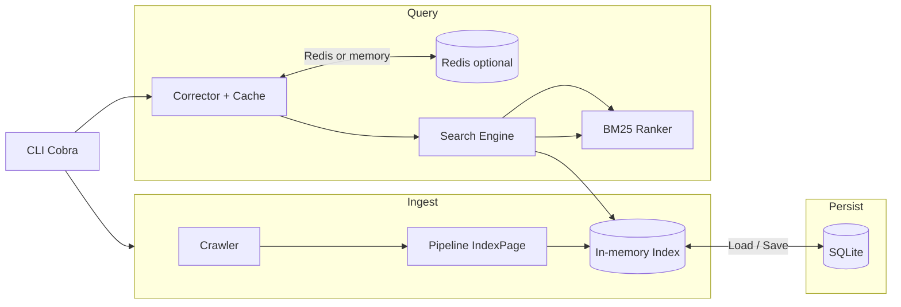

# Simplesearch

**Simplesearch** is a CLI search engine built from scratch around a small Wikipedia-focused crawler, an inverted index, **BM25** ranking, and a **fuzzy / spelling-correction** layer (local approximate matching plus optional Wikipedia suggestions). Persisted state lives in **SQLite**; optional **Redis** caches query corrections for faster repeated lookups.

---

## Features

- **Inverted index** with tokenization, stemming, and document statistics for ranking.
- **BM25 scoring** over retrieved candidate documents.
- **Fuzzy assistance** via local structures (Levenshtein-related logic, trigrams, BK-tree pieces under `internal/fuzzySearch`) and Wikipedia API fallback for spelling / titles.
- **Persistence**: index and postings stored in SQLite (`documents`, `terms`, `stats` tables plus snapshot helpers).
- **Crawler**: breadth-limited crawl from a seed URL (often resolved from your query via `internal/seed`).
- **CLI** (`cobra`): `search` and `suggest` subcommands.

---

## Tech stack & versions

| Component | Role in this repo | Version / constraint |
|-----------|-------------------|----------------------|
| **Go** | Language & toolchain (`go.mod` `go` directive) | **1.26.1** (use this or newer patch of the same minor) |
| **SQLite** | Embedded DB via pure-Go driver | **`modernc.org/sqlite` v1.50.0** — no separate `libsqlite` install required |
| **Redis** | Cache for correction results (`github.com/redis/go-redis/v9` **v9.19.0**) | **Redis 6.2+** or **Redis 7.x** recommended (`redis-cli ping` should return `PONG`) |

The installer script only **requires** Go; Redis is optional but recommended if you use `--cache redis` (the default for `--cache`).

---

## Prerequisites

1. **Go** **1.26.1+** — [https://go.dev/dl/](https://go.dev/dl/)  
   - Verify: `go version`
2. **Redis** (for Redis cache mode) — e.g. `redis-server` from your distro or Docker.  
   - Verify: `redis-cli ping` → `PONG`  
   - If Redis is down, the app falls back to an in-memory cache when Redis cannot be dialed (`internal/app`).
3. **Network** — first-time indexing crawls Wikipedia; ensure outbound HTTP/S is allowed.
4. **`sudo`** — only if you install to `/usr/local/bin` via `install.sh` (see below).

SQLite is pulled in as a Go module; you do **not** need the `sqlite3` CLI unless you want to inspect the DB manually.

---

## Install script (`install.sh`)

### Get the repo and `cd` to the root

Clone the project, then change into the cloned folder. The **repository root** is the directory that contains `go.mod`, `install.sh`, and the `cmd/` and `internal/` folders — you must run the installer from that directory (not from a parent path or a subfolder).

```bash
git clone https://github.com/waiyneee/Simplesearch.git
cd Simplesearch
```

### Run the installer

Make the script executable, then run it:

```bash
chmod +x install.sh
./install.sh
```

This installs the binary as **`/usr/local/bin/simplesearch`** (uses `sudo` when needed). After a successful install, confirm the CLI is on your `PATH`:

```bash
simplesearch --help
```

### What `install.sh` does

1. **checkPhase** — Ensures `go` is on `PATH`, `go.mod` exists, `./cmd/Simplesearch` (or `./cmd/simplesearch`) contains `main.go`, `/usr/local/bin` exists (creates it with `sudo` if missing). It checks whether `sqlite` appears in `go.mod` and warns if Redis is missing or not responding to `redis-cli ping`.
2. **buildPhase** — Runs `go build -trimpath -ldflags="-s -w"` into a temporary directory.
3. **installPhase** — Installs the binary with `sudo install -m 755`.

Example usage after installation:

```bash
simplesearch search -q "your query"
simplesearch search --cache redis -q "your query"
```

---

## Quick start

```bash
# From the repository root
go build -trimpath -ldflags="-s -w" -o simplesearch ./cmd/Simplesearch

# Search (opens the SQLite store under data/, may crawl + index on first run)
./simplesearch search -q "your query"

# Spelling / suggestions (local index + Wikipedia API)
./simplesearch suggest -q "appple"
```

## CLI usage

Configuration is driven by **subcommands and flags** shown below — no `.env` or separate config file workflow.

**Subcommands**

| Command | Purpose |
|---------|---------|
| `simplesearch` | Prints a short welcome and hints |
| `simplesearch search` | Run a search (query via `-q` or a single positional argument) |
| `simplesearch suggest` | Show local + Wikipedia spelling / title suggestions |

**Global flags** (defined on the root command, available to subcommands)

| Flag | Short | Default | Description |
|------|-------|---------|-------------|
| `--query` | `-q` | *(empty)* | Search or suggest query string |
| `--limit` | `-k` | `10` | Maximum number of search results |
| `--body-lines` | | `8` | Max lines of snippet text per result |
| `--wrap` | | `110` | Character wrap width for snippets |
| `--cache` | | `redis` | Correction cache: `redis` or `memory` |
| `--redis-url` | | `redis://localhost:6379` | Redis address when `--cache redis` |

Examples:

```bash
simplesearch search -q "your query" -k 5 --cache memory
simplesearch search --cache redis --redis-url "redis://127.0.0.1:6379/0" -q "nodejs"
simplesearch suggest "recieve"
```

---

## Project layout

The **Go program entry point** is **`cmd/Simplesearch/main.go`**: it defines `package main` and calls `Execute()` from `root.go`, which registers Cobra commands and runs the CLI. Everything under `internal/` is library code imported by that main package (and by each other); it is not a separate binary.

All **`.go` source files** in the repository:

```
.
├── cmd/
│   └── Simplesearch/
│       ├── main.go            # entry: func main() → Execute()
│       ├── root.go            # Cobra root command, global flags
│       ├── search.go          # search subcommand
│       └── suggest.go         # suggest subcommand
├── internal/
│   ├── app/
│   │   ├── app.go
│   │   ├── config.go
│   │   └── run.go
│   ├── crawler/
│   │   ├── crawler.go
│   │   ├── extract_content.go
│   │   ├── extract_links.go
│   │   ├── fetch.go
│   │   ├── frontier.go
│   │   └── url.go
│   ├── format/
│   │   └── text.go
│   ├── fuzzySearch/
│   │   ├── bktree/
│   │   │   └── bk-tree.go
│   │   ├── dictionary/
│   │   │   └── dictionary.go
│   │   ├── engine/
│   │   │   ├── engine.go
│   │   │   └── interface.go
│   │   ├── levenshtein/
│   │   │   └── levenshtein.go
│   │   ├── trigram/
│   │   │   └── trigram.go
│   │   └── types/
│   │       └── suggestion.go
│   ├── index/
│   │   ├── dbhelpers.go
│   │   ├── index.go
│   │   ├── postings.go
│   │   ├── stemmer.go
│   │   ├── tokenizer.go
│   │   ├── types.go
│   │   └── vocab.go
│   ├── pipeline/
│   │   └── indexer.go
│   ├── ranking/
│   │   ├── bm25.go
│   │   └── scorer.go
│   ├── Search/
│   │   ├── engine.go
│   │   ├── matcher.go
│   │   ├── parser.go
│   │   └── query.go
│   ├── seed/
│   │   └── seed.go
│   ├── storage/
│   │   ├── createSchema.go
│   │   ├── dbInit.go
│   │   └── dbSnapshot.go
│   └── suggest/
│       ├── cache.go
│       ├── corrector.go
│       ├── local.go
│       └── wikiapi.go
├── data/                      # default SQLite path (often gitignored)
├── go.mod
├── go.sum
├── install.sh
└── Readme.md
```

---

## Architecture

1. **CLI (`cmd/Simplesearch`)** parses flags and invokes `search` or `suggest`. Search opens SQLite, loads an existing index (or triggers a crawl if empty).
2. **Crawl & index build** (`internal/crawler` → `internal/pipeline.IndexPage`) fetches Wikipedia HTML, extracts text and links (bounded depth/pages), and adds documents through `internal/index`.
3. **Search path** (`internal/Search.Engine`): optional **query correction** (`internal/suggest.Corrector` — cache, then local fuzzy suggestor, then Wikipedia) → query parsing → **OR-style candidate retrieval** from inverted postings → **BM25** scoring (`internal/ranking`).
4. **Persistence** (`internal/storage`): SQLite holds documents, per-doc term frequencies, and corpus stats so the index can be reloaded without recrawling when the DB already has data.
5. **Fuzzy stack** (`internal/fuzzySearch`, `internal/suggest`): supports approximate vocabulary / title matching layered with network-backed Wikipedia hints.
6. **Redis** sits only on the **suggestion-cache** path when enabled; ranking and postings remain in-process + SQLite-backed data structures.


